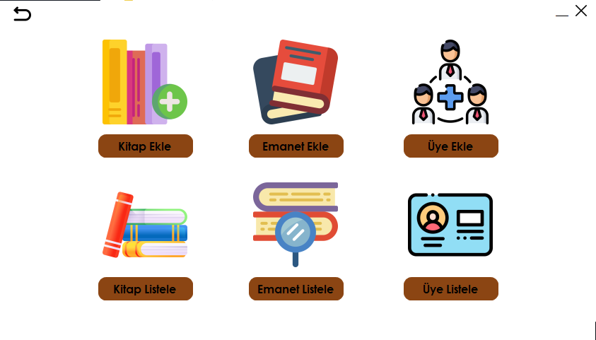
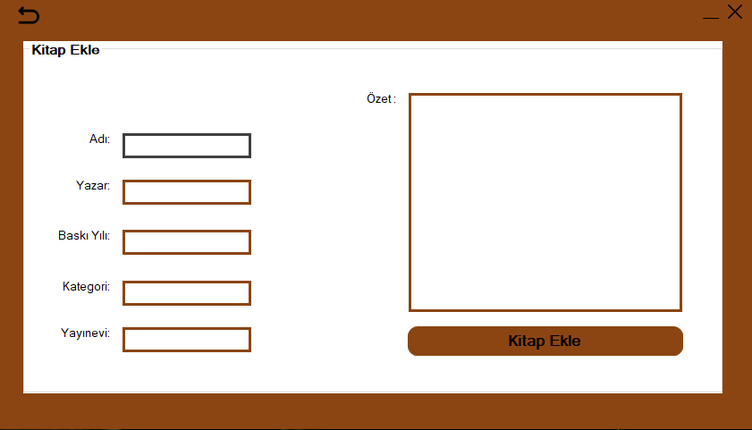
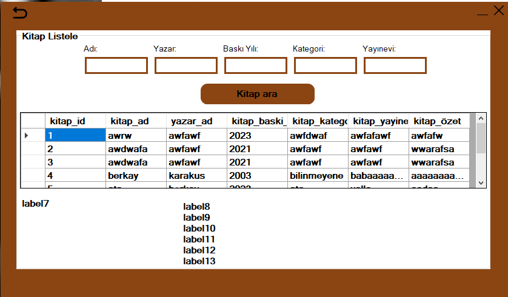
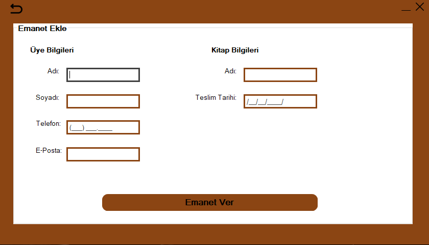
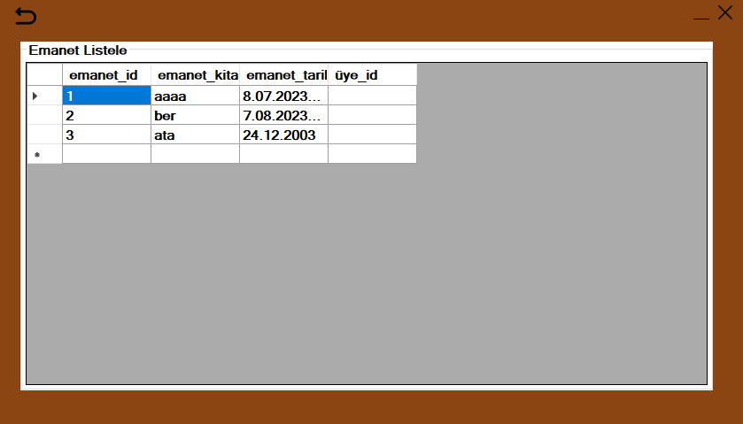
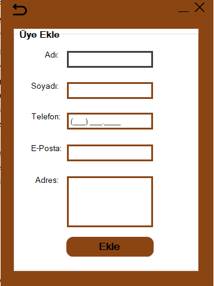
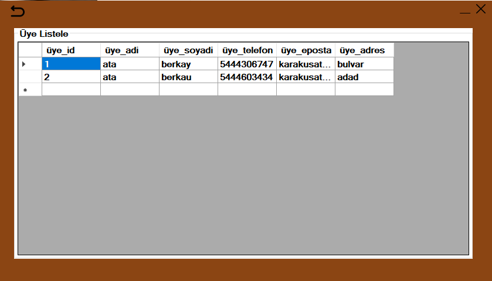

# Kütüphane Otomasyonu

Bu proje, bir kütüphanede kitap ödünç alma ve iade etme işlemlerini takip etmek için geliştirilmiş bir **Kütüphane Otomasyonu** sistemidir. **C# Windows Forms Application** kullanılarak yapılmıştır.

## Ekran Görüntüleri

## Giriş Ekranı

## Ana Ekran

## Kitap Ekle Ekranı

## Kitap Listele Ekranı

## Emanet Ekle Ekranı

## Emanet Listele Ekranı

## Üye Ekle Ekranı

## Üye Listele Ekranı

### Gereksinimler

- **Visual Studio 2022** veya daha güncel sürüm
- **.NET Framework **
- **SQL Server** (Veritabanı için)

## Lisans
Bu proje [MIT Lisansı](LICENSE) altında lisanslanmıştır.
